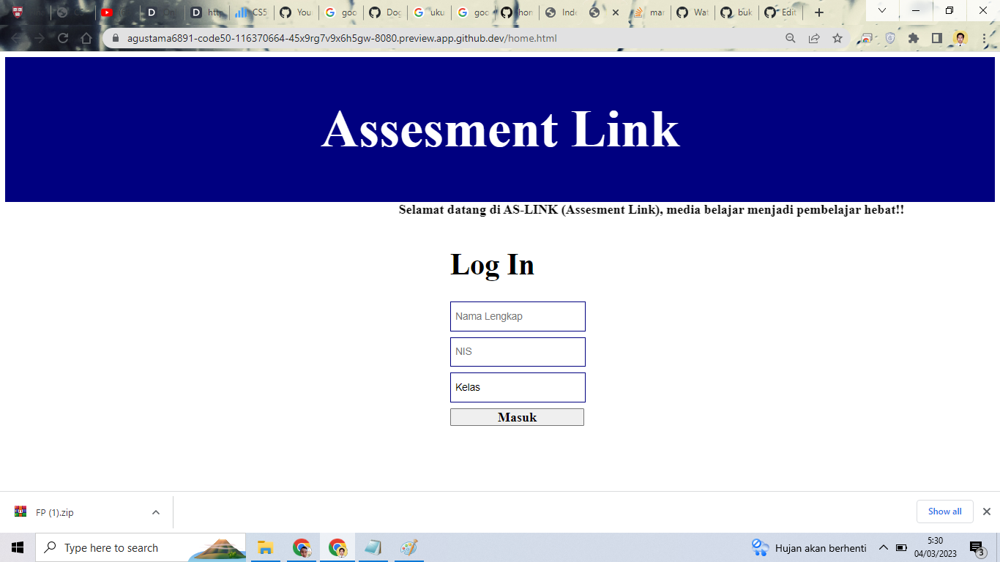
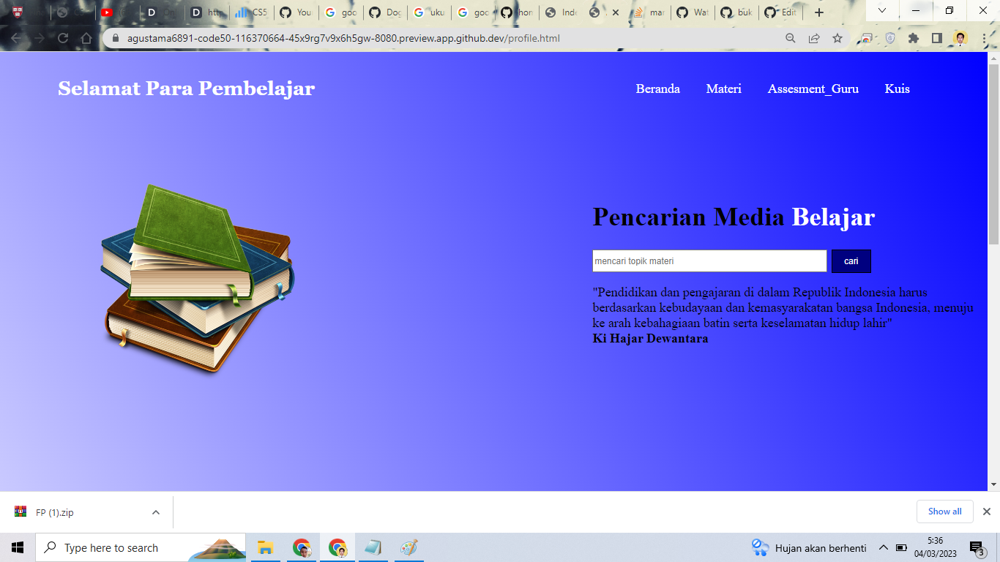
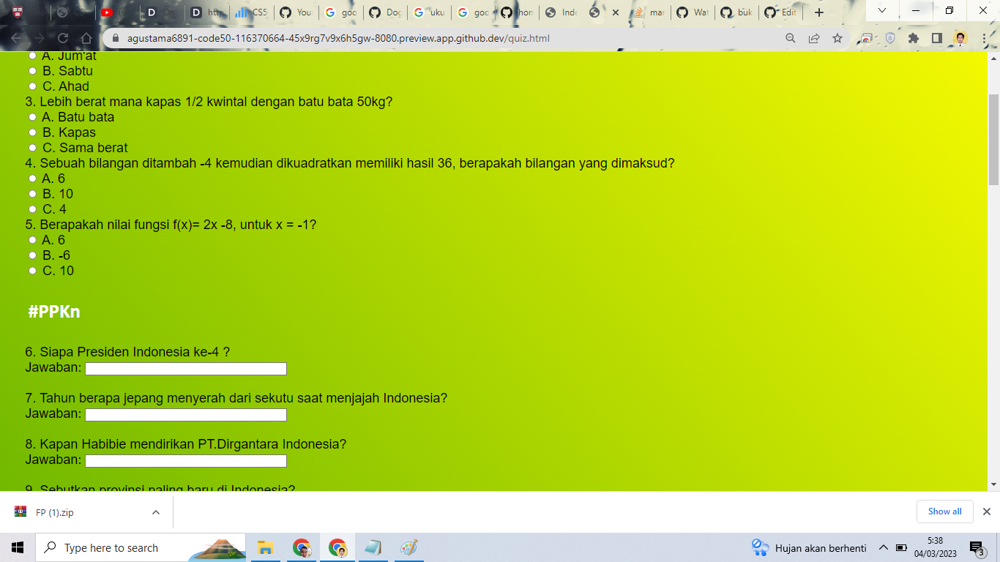

# CS50-Final-Project
## Title
AS-Link (Assesment Link)

## My Final-Project Team
1. Yudha Agustama
2. Muchammad Syaifudin Zuhri

## Description
A web page that contains learning media for teachers as well as for students. On this page the teacher can also interact with students through the acquisition of the grades obtained. Only for the project this time adjusting to the final project proposal only until a **good outcome** results, namely student practice questions. However, for page design or layout it is quite interactive.

## Main Idea
The main concept in this app is 3 parts:
**1. Login Page** 
**2. Profile Page** 
**3. Question Practice Page (Quiz)** 

## Features
* **Login**, Contains pages for initial identification of student biodata, to ascertain who is running the program
* **From Cari**, This is a form for searching for a material topic that students want to obtain or understand
* **Kuis**, This page contains student practice questions, questions made in three forms, multiple choice questions, short answer questions, and checklist questions. From here students are able to know the value directly (_Best Outcome)
* **Assesment_Guru**, This page contains pages for teachers to arrange questions that will be made individually (_Better Outcome)

## How To use it
The steps for using this application are:
1. **First**, enter your identity in the form of full name, NIS (student identification number), and class. Then press **"Masuk"**
2. **Second**, after on the profile page select the desired sub menu (_"materi", _"assessment_guru", _"kuis", or _"pencarian media belajar")
3. **Third**, if you want other than _"pencarian media belajar_ search sub menu, just click
4. **Fourth**, if you want a _"pencarian media belajar"_ sub menu, please type the keywords you want to search for then click _"cari"
5. **Fifth**, the sub menu currently available for this application is _"kuis"
6. **Sixth**, after on the _"kuis"_ page, please be able to do the quiz, press _submit answers to submit
7. **Seventh**, when it's finished, a value that can be seen personally (_best outcome) will appear

## Video Link
For the fulfillment of the CS50 task, the following link can be seen [Our Final Project](https://youtu.be/YvD7T3AudjY)

## About CS50
CS50 is a short training provider hailing from harvard university and taught by David J.Malan

